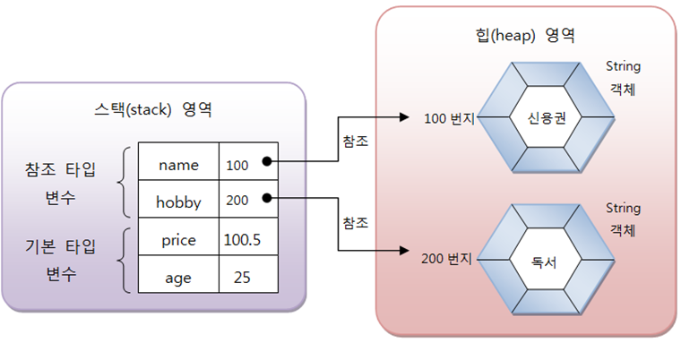

# 이것이 자바다 - Part05 - Chapter05 참조 타입

## 목차
- [5.1 데이터 타입 분류](#51-데이터-타입-분류)

## `5.1 데이터 타입 분류`
자바의 데이터 타입은 크게 `기본 타입(primitive type)과 참조 타입(reference type)`으로 분류된다.

### 데이터 타입
- 기본 타입
  - 정수 타입 : byte, char, short, int, long
  - 실수 타입 : float, double
  - 논리 타입 : boolean
- 참조 타입
  - 배열 타입
  - 열거 타입
  - 클래스
  - 인터페이스
> 기본 타입으로 선언된 변수와 참조 타입으로 선언된 변수의 차이점은 저장되는 값이다.
> 기본 타입으로 선언된 변수는 값 자체를 저장하지만 참조 타입으로 선언된 변수는 객체가 생성된 메모리 번지를 저장한다.

### 예시
```java
// 기본 타입 변수
int age = 25;
double price = 100.5;

// 참조 타입 변수
String name = "신용권";
String hobby = "독서";
```



- 변수들은 모두 Stack이라는 메모리 영역에 생성된다.
- 기본 타입 변수인 age와 price는 직접 값을 저장하고 있다.
- 참조 타입 변수인 name과 hobby는 힙 메모리 영역의 String 객체 번지를 저장하고 이 번지를 통해 String 객체를 참조한다.

