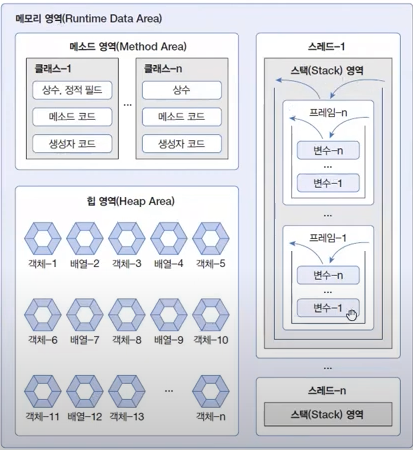
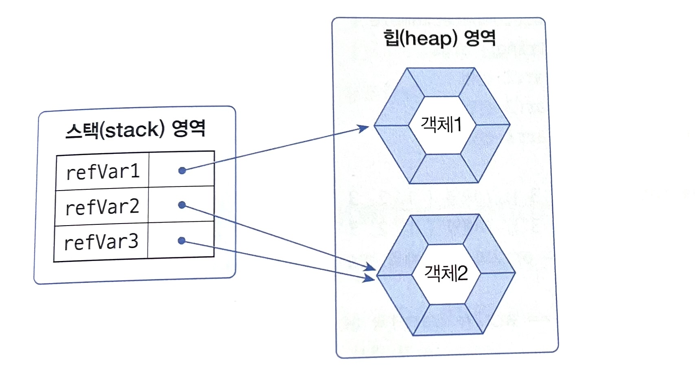

# 이것이 자바다 - Part05 - Chapter05 참조 타입

## 목차
- [5.1 데이터 타입 분류](#51-데이터-타입-분류)
- [5.2 메모리 사용 영역](#52-메모리-사용-영역)
- [5.3 참조 타입 변수의 ==, != 연산](#53-참조-타입-변수의---연산)
- [5.4 null과 NullPointerException](#54-null과-nullpointerexception)

## `5.1 데이터 타입 분류`
자바의 데이터 타입은 크게 `기본 타입(primitive type)과 참조 타입(reference type)`으로 분류된다.

### 데이터 타입
- 기본 타입
  - 정수 타입 : byte, char, short, int, long
  - 실수 타입 : float, double
  - 논리 타입 : boolean
- 참조 타입
  - 배열 타입
  - 열거 타입
  - 클래스
  - 인터페이스
> 기본 타입으로 선언된 변수와 참조 타입으로 선언된 변수의 차이점은 저장되는 값이다.
> 기본 타입으로 선언된 변수는 값 자체를 저장하지만 참조 타입으로 선언된 변수는 객체가 생성된 메모리 번지를 저장한다.

### 예시
```java
// 기본 타입 변수
int age = 25;
double price = 100.5;

// 참조 타입 변수
String name = "신용권";
String hobby = "독서";
```


- 변수들은 모두 Stack이라는 메모리 영역에 생성된다.
- 기본 타입 변수인 age와 price는 직접 값을 저장하고 있다.
- 참조 타입 변수인 name과 hobby는 힙 메모리 영역의 String 객체 번지를 저장하고 이 번지를 통해 String 객체를 참조한다.


## `5.2 메모리 사용 영역`
java 명령어로 JVM이 구동되면 JVM은 OS에서 할당받은 `메모리 영역(Runtime Data Area)`을 다음과 같이 구분해서 사용한다.



### 메소드 영역
- 바이트코드 파일을 읽어 내용이 저장되는 영역
- 클래스별로 상수, 정적 필드, 메소드 코드, 생성자 코드 등이 저장된다.

### 힙 영역
- 객체가 생성되는 영역
- 객체의 번지는 메소드 영역과 스택 영역의 상수와 변수에서 참조할 수 있다.

### 스택 영역
- 메소드를 호출할 때마다 생성되는 Frame이 저장되는 영역
- 메소드 호출이 끝나면 Frame은 자동 제거
- Frame 내부에는 로컬 변수 스택이 존재하며, 여기에서 기본 타입 변수와 참조 타입 변수가 생성되고 제거된다.


## `5.3 참조 타입 변수의 ==, != 연산`
- `==, != 연산자는 변수의 값이 같은지, 아닌지를 조사한다.`
- 참조 타입 변수의 값은 객체의 번지이므로
참조 타입 변수의 ==, != 연산자는 `번지수가 같은지 비교하는 것`이 된다.



```
refVar1 == refVar2  -> false
refVar2 == refVar3  -> true
```

- 물론 같은 값들을 가지더라도 번지수가 다르면 다르다.

```java
int [] arr1 = new int[]{1,2,3};
int [] arr2 = new int[]{1,2,3};
int [] arr3 = arr2;

System.out.println(arr1 == arr2);
System.out.println(arr2 == arr3);
```
```
결과
 
false
true
```

## `5.4 null과 NullPointerException`

- 참조 타입 변수는 아직 번지를 저장하고 있지 않다는 뜻으로 null 값을 가질 수 있다. 
- null도 초기값으로 사용될 수 있기 때문에 null로 초기화된 참조 타입 변수는 스택 영역에 생성된다.


- 참조 타입 변수가 null 값을 가지는지 확인하기위해 ==, != 연산도 수행할 수 있다.
```java
String ref = null;
System.out.println(ref == null); // true
```

- 자바는 프로그램 도중에 발생하는 오류를 Exception라고 부르며 참조 변수가 null인 상태에서 그 객체의 데이터나
메소드를 사용하려 할 때 `NullPointerException`이 발생한다.
```java
String str = null;
System.out.println(str.length()); // NullPointerException
```
> 앞으로 NullPointerException이 발생하면 예외가 발생된 곳에서 null인 상태의 참조 변수가 사용되고 있음을 알아야 한다.

- 경우에 따라서는 참조 타입 변수에 일부러 null을 대입하기도 한다. 프로그램에서 객체를 사용하려면 해당 객체를 참조하는 변수를
이용해야 하는데, 변수에 null을 대입하면 번지를 읽게 되므로 더 이상 객체를 사용할 수 없게 된다.


> 어떤 변수에서도 객체를 참조하지 않으면 해당 객체는 힙 메모리에는 있지만, 위치 정보를 모르기 때문에 사용할 수 없게된다. 자바는 이러한 객체를 Garbage Collector를 실행시켜 자동으로 제거한다. <br>
> 또한 자바에서 코드를 이용해 객체를 직접 제거하는 방법을 제공하지 않기 때문에 객체를 제거하는 유일한 방법은 객체의 모든 참조를 없애는 것 뿐이다. 

- 다음 코드에서 "trip"에 해당하는 String 객체는 쓰레기가 된다.
```java
String hobby = "trip";
hobby = "game"
```

- null을 대입한다고 해서 쓰레기 객체가 되는 것은 아니다. 자신을 참조하는 변수가 없는 객체만이 쓰레기 객체가 될 수 있다.
```java
String kind1 = "car";
String kind2 = kind2;
kind1 = null;
```
> 해당 코드에서 kind1에 null을 대입하였지만  "car" 객체를 아직 kind2가 참조하고 있으므로 "car" 객체는 쓰레기 객체가 되지 않는다.
