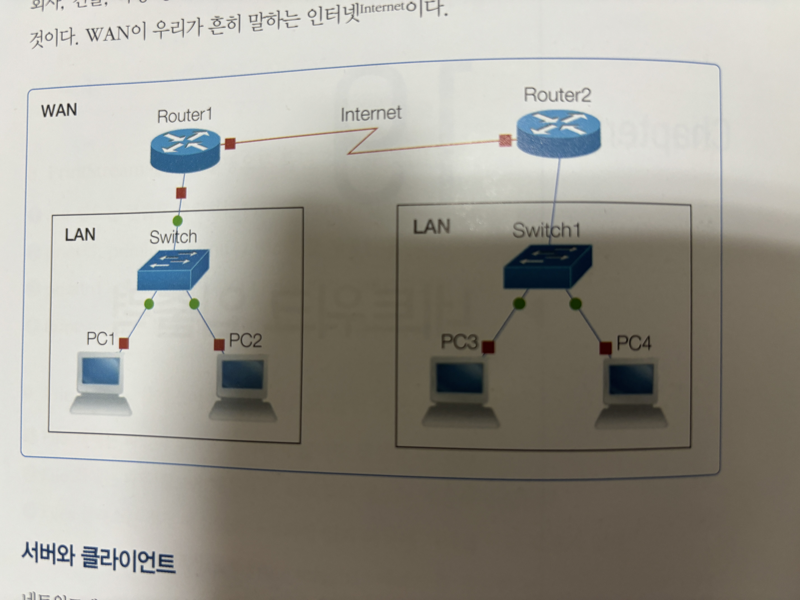
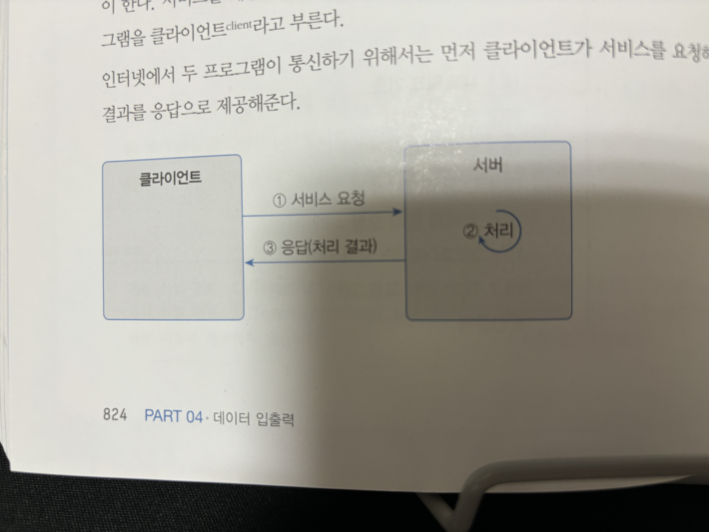
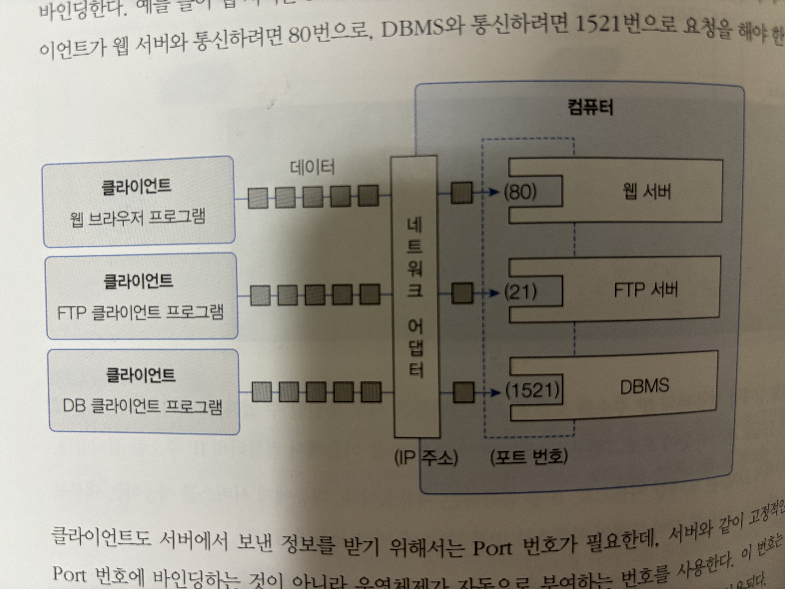
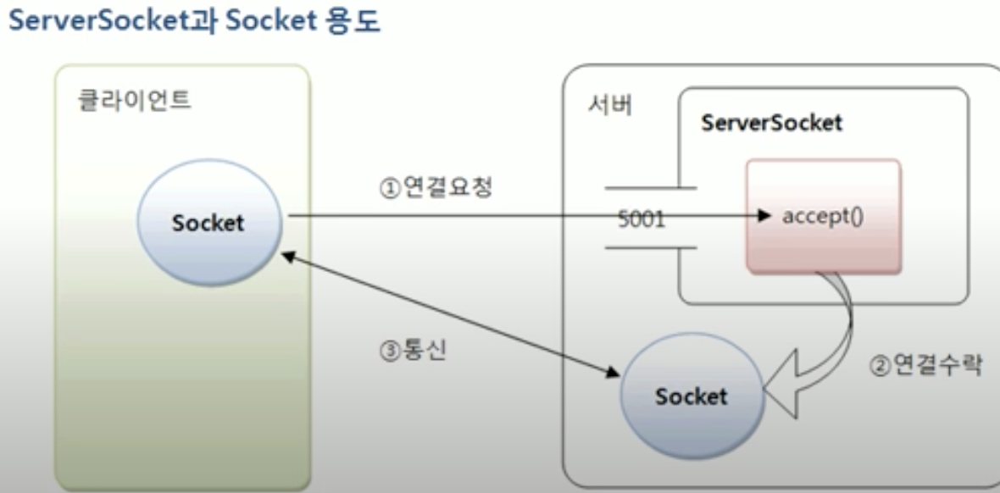

# 이것이 자바다 - Part04 - Chapter19 네트워크 입출력

## 목차
- [19.1 네트워크 기초](#191-네트워크-기초)
- [19.2 IP 주소 얻기](#192-ip-주소-얻기)
- [`19.3 TCP 네트워킹`](#193-tcp-네트워킹)

## `19.1 네트워크 기초`



- 네트워크는 여러 컴퓨터들을 통신 회선으로 연결한 것
- LAN (Local Area Network)은 가정, 회사, 건물, 특정 영역에 존재하는 컴퓨터를 연결한 것
- `WAN (Wide Area Network)`은 LAN을 연결한 것으로 우리가 흔히 말하는 Internet

### 서버와 클라이언트
- 네트워크에서 유무선으로 컴퓨터가 연결되어 있다면 실제로 데이터를 주고받는 행위는 프로그램들이 한다.
- 서비스를 제공하는 프로그램을 일반적으로 `server`, 서비스를 요청하는 프로그램을 일반적으로 `client`
- 인터넷에서 두 프로그램이 통신하기 위해서 클라이언트가 먼저 서버에게 요청을 보내고 서버는 요청을 처리한 결과를 응답으로 제공해준다.



### IP 주소
- 우리 집에 고유한 주소가 있어 우편물이나 택배가 정확하게 우리 집에 도착하는 것처럼 `컴퓨터에도 고유한 주소가 있다.`
- 이러한 주소를 `IP (Internet Protocol)`주소라고 한다.
- IP주소는 `네트워크 어댑터(LAN 카드)`마다 할당된다. 예를 들어 두 개의 네트워크 어댑터가 컴퓨터에 존재하면 그 컴퓨터는 두개의 IP주소를 할당받을 수 있다.
- 네트워크 어댑터에 어떤 IP주소가 부여되어 있는지 확인하는 명령어는 window는 ipconfig, 맥OS는 ifconfig
- IP주소는 xxx.xxx.xxx.xxx와 같은 형식이며 xxx는 부호 없는 0~255 사이의 정수이다.
- 연결할 상대방의 IP주소를 모른다면 프로그램들은 통신할 수 없다. 우리가 전화번호를 모를 때 114로 문의 하듯이 프로그램은 `DNS (Domain Name System)`를 이용해 컴퓨터의 IP주소를 검색한다.
- DNS는 도메인 이름으로, IP를 등록하는 저장소이다. 대중에게 서비스를 제공하는 대부분의 컴퓨터는 다음과 같이 도메인 이름으로 IP를 DNS에 미리 등록해 놓는다.
```
  도메인 이름    :      IP주소
------------------------------
www.naver.com : 222.122.295.5
```
- `웹 브라우저는 웹 서버와 통신하는 클라이언트`로, 사용자가 입력한 도메인 이름을 DNS에서 검색하여 해당 IP주소를 얻어낸 다음 웹 서버와 연결해서 웹 페이지를 받는다.

### Port 번호
- 한 대의 컴퓨터에는 다양한 서버 프로그램들이 실행 가능. 예를 들어 웹 서버, DBMS, FTP 서버 등이 하나의 IP주소를 갖는 컴퓨터에서 동시에 실행될 수 있다.
- 이 경우 클라이언트는 어떤 서버와 통신할지 Port 번호를 통해 결정할 수 있다.
- IP는 컴퓨터의 네트워크 어댑터 까지만 갈 수 있는 정보이고 이 컴퓨터 내부에서 실행되는 서버와 연결하기 위해서는 추가적인 Port 번호가 필요하다.
- `Port`는 OS가 관리하는 서버 프로그램의 연결 번호이며, 서버는 시작할 때 특정 Port 번호에 바인딩한다.
- 예를 들어 웹 서버는 80, DBMS는 1521번으로 바인딩할 수 있다.



- 클라이언트도 서버에서 보낸 정보를 받기 위해 Port번호가 필요하며 OS가 자동으로 부여하는 번호를 사용한다. 이 번호는 클라이언트가 서버로 요청할 때 함께 전송되어 서버가 클라이언트로 데이터를 보낼 때 사용된다.
- 전체 Port번호의 범위는 0~65535이며, 다음과 같이 사용 목적에 따라 세 가지 범위를 가진다.

| 구분명 | 범위 |설명|
|:---:|:---:|:---:|
|Well Known Port Numbers|0~1023|국제인터넷주소관리기구(ICANN)가 특정<br>애플리케이션용으로 미리 예약한 Port|
|Registered Port Numbers|1024~49151|회사에서 등록해서 사용할 수 있는 Port|
|Dynamic Or Private Port Numbers|49152~65535|OS가 부여하는 동적 Port 또는<br>개인적인 목적으로 사용할 수 있는 Port|


## `19.2 IP 주소 얻기`
- 자바는 IP 주소를 java.net 패키지의 InetAddress로 표현한다.
- InetAddress를 이용해 로컬 컴퓨터의 IP 주소를 얻을 수 있고, 도메인 이름으로 DNS에서 검색한 후 IP 주소를 가져올 수도 있다.
- 로컬 컴퓨터와 Naver의 IP주소 출력하기

  ```java
  import java.net.InetAddress;

  public class InetAddressExample {
    public static void main(String[] args) {
      try{
        InetAddress local = InetAddress.getLocalHost();
        System.out.println("내 컴퓨터 IP 주소 : " + local.getHostAddress());

        InetAddress[] isArr = InetAddress.getAllByName("www.naver.com");
        for(InetAddress remote : isArr){
          System.out.println("www.naver.com IP 주소: " + remote.getHostAddress());
        }
      }catch(Exception e){
        e.printStackTrace();
      }
    }
  }
  ```
  ```
  결과 

  내 컴퓨터 IP 주소 : 127.0.0.1
  www.naver.com IP 주소: 223.130.192.247
  www.naver.com IP 주소: 223.130.192.248
  www.naver.com IP 주소: 223.130.200.219
  www.naver.com IP 주소: 223.130.200.236
  ```
- InetAddress의 getLocalHost() static method를 이용하여 로컬 컴퓨터의 InetAddress를 얻을 수 있다.
- 또한 InetAddress의 getHostAddress() instance method를 이용하여 IP주소를 출력할 수 있다.
- 만약 컴퓨터의 도메인 이름을 알고 있다면 다음 두 개의 메소드를 사용하여 InetAddress 객체를 얻을 수 있다.
```java
InetAddress ia = InetAddress.getByName("www.naver.com");
InetAddress[] isArr = InetAddress.getAllByName("www.naver.com");
```
> getByName()은 하나의 InetAddress 객체를 가져오고 getAllByName()는 하나의 도메인 이름으로 여러 IP가 등록되어 있는 경우
> 여러 개의 InetAddress 객체들을 가져온다. 여러 IP가 등록되어 있는 이유는 서버의 부하를 나누기 위해서이다.


## `19.3 TCP 네트워킹`

- IP 주소로 프로그램들이 통신할 때는 약속된 `데이터 전송 규약(transmission protocol)`이 있다.
- 인터넷에서 전송용 프로토콜은 `TCP(Transmission Control protocol)와 UDP(User Datagram Protocol)`가 있다.
- 이중 `TCP는 연결형 프로토콜로`, 상대방이 연결된 상태에서 데이터를 주고 받는다.
- `클라이언트가 연결 요청을 하면 서버가 연결 요청을 수락하여 통신 회선이 고정되고, 데이터는 고정 회선을 통해 전달된다.`
- 그렇기 때문에 TCP는 보낸 데이터가 순서대로 전달되며 손실이 발생하지 않는다.
- TCP는 IP와 함께 사용되어 TCP/IP라고 불리며 웹 브라우저가 웹 서버에 연결할 때 사용되며 이메일 전송, 파일 전송, DB연동에도 사용된다.
- 자바는 TCP 네트워킹을 위해 java.net 패키지에서 ServerSocket과 Socket 클래스를 제공하며, ServerSocket은 클라이언트의
연결을 수락하는 서버 쪽 클래스이고 `Socket은 클라이언트에서 연결 요청할 때`와 `클라이언트와 서버 양쪽에서 데이터를 주고 받을 때` 사용되는 클래스이다.



> ServerSocket을 생성할 때는 바인딩할 Port번호를 지정해야 한다.<br>
> 위 그림에서는 5001번이 Port이며 서버가 실행될 때 클라이언트는 Socket을 이용해 서버의 IP 주소와 Port 번호로 연결 요청을 할
> 수 있다. <br>
> ServerSocket은 accpet() 메소드로 연결 수락을 하고 통신용 Socket을 생성한다. 그리고 나서 클라이언트와 서버는 양쪽의
> Socket을 이용해서 데이터를 주고받게 된다.

### TCP 서버
- TCP 서버 프로그램을 개발하기위해 ServerSocket 객체를 생성해야 한다. 다음은 50001번 Port에 바인딩하는 ServerSocket 생성 코드이다.
  ```java
  ServerSocket serverSocket = new ServerSocket(50001);
  ```
- ServerSocket을 생성하는 또 다른 방법은 기본 생성자로 객체를 생성하고 Port 바인딩을 위해 bind()를 호출하는 것
  ```java
  ServerSocket serverSocket = new ServerSocket();
  serverSocket.bind(new InetSocketAddress(50001));
  ```
- 만약 서버 컴퓨터에 여러 개의 IP가 할당되어 있을 경우, 특정 IP에서만 서비스를 하고 싶다면 InetSocketAddress의 첫 번째 매개값으로 해당 IP를 주면 된다.
  ```java
  ServerSocket serverSocket = new ServerSocket();
  serverSocket.bind(new InetSocketAddress("xxx.xxx.xxx.xxx",50001));
  ```
- 만약 Port가 이미 다른 프로그램에서 사용중이라면 `BindException`이 발생한다. 이 경우 다른 Port로 바인딩하거나 해당 Port를 사용하는 프로그램을 종료 시키면 된다.
- ServerSocket이 생성되었다면 연결 요청 수락을 위해 accept() 메소드를 실행해야 하며 accept()는 클라이언트가 연결 요청하기 전까지 블로킹 된다. 클라이언트의 연결 요청이 들어오면 블로킹이 해제되고 통신용 Socket을 리턴한다.
  ```java
  Socket scoket = serverSocket.accept();
  ```
- 만약 리턴된 Socket을 통해 연결된 클라이언트의 IP 주소와 Port 번호를 얻고 싶다면 방법은 getRemoteSocketAddress() 메소드를 호출해서 InetSocketAddress를 얻은 다음 getHostName()과 getPort() 메소드를 호출하면 된다.
  ```java
  InetSocketAddress isa = (InetSocketAddress) socket.getRemoteSocketAddress();
  String clientIp = isa.getHostName();
  String portNo = isa.getPort();
  ```
- 서버를 종료하려면 ServerSocket의 close() 메소드를 호출해서 Port 번호를 언바인딩시켜야 한다.그러면 다른 프로그램에서 해당
Port 번호를 재사용할 수 있다.
  ```java
  serverSocket.close();
  ```
- 다음 코드는 반복적으로 accept() 메소드를 호출해서 클라이언트의 연결 요청을 계속 수락하는 TCP 서버의 가장 기본적인 코드이다.
  ```java
  import java.io.IOException;
  import java.net.InetSocketAddress;
  import java.net.ServerSocket;
  import java.net.Socket;
  import java.util.Scanner;

  public class ServerExample {
    private static ServerSocket serverSocket = null;
    public static void main(String[] args) {
      System.out.println("----------------------------------------------");
      System.out.println("서버를 종료하려면 q 또는 Q를 입력하고 Enter 키를 입력하세요.");
      System.out.println("----------------------------------------------");

      //TCP 서버 시작
      startServer();

      //키보드 입력
      Scanner scanner = new Scanner(System.in);
      while(true){
        String key = scanner.nextLine();
        if(key.toLowerCase().equals("q")){
          break;
        }
      }
      scanner.close();

      //TCP 서버 종료
      stopServer();
    }

    public static void startServer(){
      //작업 스레드 정의
      Thread thread = new Thread(){
        @Override
        public void run() {
          try{
            //ServerSocket 생성 및 Port 바인딩
            serverSocket = new ServerSocket(50001);
            System.out.println("[서버] 시작됨");

            while(true){
              System.out.println("\n[서버] 연결 요청을 기다림\n");
              //연결 수락
              Socket socket = serverSocket.accept();

              //연결된 클라이언트 정보 얻기
              InetSocketAddress isa = (InetSocketAddress) socket.getRemoteSocketAddress();
              System.out.println("[서버] "+isa.getHostName() + "의 연결 요청을 수락함");

              //연결 끊기
              socket.close();
              System.out.println("[서버] " + isa.getHostName() + "의 연결을 끊음");
            }
          }catch(IOException e){
            System.out.println("[서버] " + e.getMessage());
          }
        }
      };
      //스레드 시작
      thread.start();
    }

    public static void stopServer(){
      try{
        //ServerSocket을 닫고 Port 언바인딩
        serverSocket.close();
        System.out.println("[서버] 종료됨");
      }catch (IOException e1){}
    }
  }
  ```
  > Netcat을 이용하여 TCP연결 요청을 보내면 성공적으로 연결되는 것을 볼 수 있다.
  ```zsh
  nc -vz localhost 50001
  ```


### TCP 클라이언트
- 클라이언트가 서버에 연결 요청을 하려면 Socket 객체를 생성할 때 생성자 매개값으로 `서버 IP 주소와 Port번호를 제공`하면 된다. 로컬 컴퓨터에서 실행하는 경우 IP 주소 대신 localhost 사용 가능
  ```java
  Socket socket = new Socket("IP", 50001);
  ```

- IP 주소 대신 도메인 이름을 사용하는 것도 가능. 이때 DNS에서 IP주소를 검색할 수 있도록 `InetAddress를 제공`해야 한다.
  ```java
  Socket socket = new Socket(new InetAddress.getByName("domainName",50001));
  ```

- Socket 생성과 동시에 연결 요청을 하지 않고 다음과 같이 기본 생성자로 생성 후 connect() 메소드로 연결 요청을 할 수도 있다.
  ```java
  Socket socket = new Scoket();
  socket.connect(new InetSocketAddress("domainName", 50001))
  ```

- 연결 요청 시 두가지 예외가 발생할 수 있으며 이 두 가지 예외를 모두 처리해야 한다.
  - UnknownHostException : IP 주소가 잘못 표기 되었을 때 발생
  - IOException : 제공된 IP와 Port번호로 연결할 수 없을 때 발생
  ```java
  try{
    Socket socket = new Socket("IP", 50001);
  }catch(UnknownHostException e){

  }catch(IOException e){
    
  }
  ```

- 서버와 연결된 후에 클라이언트에서 연결을 끊고 싶다면 close() 메소드를 호출하면 된다.
  ```java
  socket.close();
  ```

- 다음은 이전 예제인 ServerExample에 연결 요청을 하는 TCP 클라이언트의 가장 기본적인 코드이다.
  ```java
  import java.io.IOException;
  import java.net.Socket;
  import java.net.UnknownHostException;

  public class ClientExample {
    public static void main(String[] args) {
      try{
        //Socket 생성과 동시에 localhost의 50001 Port로 연결 요청
        Socket socket = new Socket("localhost",50001);

        System.out.println("[클라이언트] 연결 성공");

        //Socket 닫기
        socket.close();
        System.out.println("[클라이언트] 연결 끊음");
      }catch (UnknownHostException e){
        System.out.println("IP 표기 방법이 잘못되었을 경우");
      }catch (IOException e){
        System.out.println("해당 포트의 서버에 연결할 수 없는 경우");
      }
    }
  }
  ```
  > ServerExample먼저 실행 후 ClientExample를 실행시키면 다음과 같은 결과가 출력된다.
  ```
  ServerExample 결과 

  ----------------------------------------------
  서버를 종료하려면 q 또는 Q를 입력하고 Enter 키를 입력하세요.
  ----------------------------------------------
  [서버] 시작됨

  [서버] 연결 요청을 기다림

  [서버] localhost의 연결 요청을 수락함
  [서버] localhost의 연결을 끊음

  [서버] 연결 요청을 기다림


  q
  [서버] 종료됨
  [서버] Socket closed
  ```
  ```
  ClientExample 결과

  [클라이언트] 연결 성공
  [클라이언트] 연결 끊음
  ```

### 입출력 스트림으로 데이터 주고 받기
